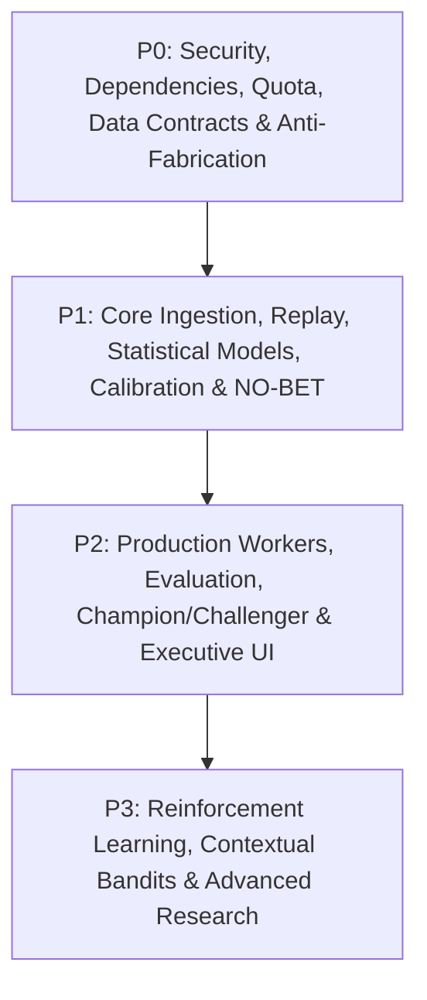
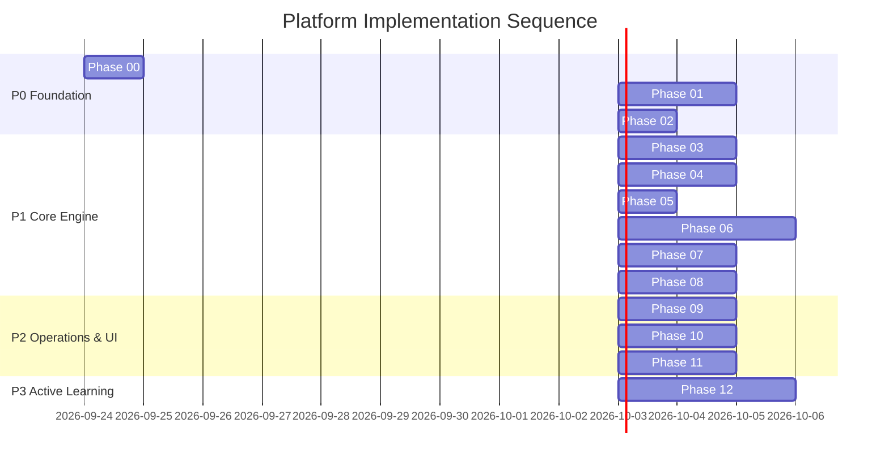
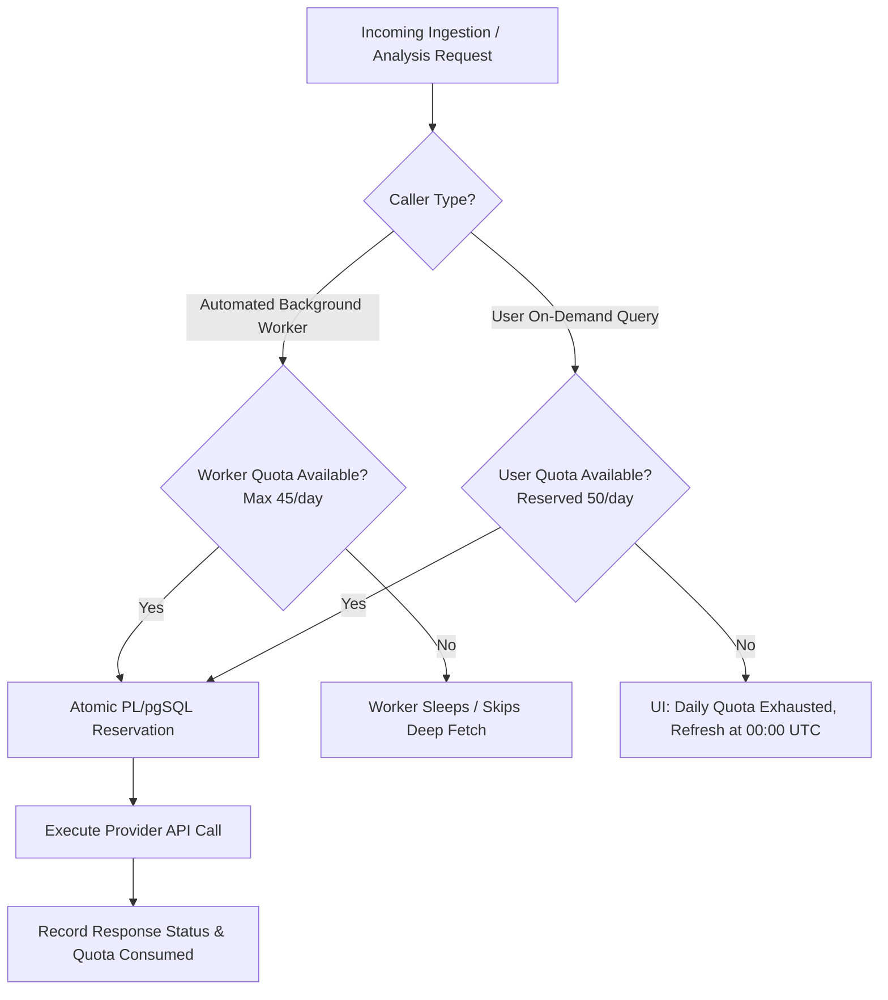

# MASTER DEVELOPMENT PLAN
# Football Prediction Intelligence Platform — Phased, Criticality-Driven Architecture

**Author**: Gemini 3.8 Flash High (Principal Planning & Architecture Agent)  
**Target Execution Agent**: Claude Sonnet 4.6 Thinking  
**Repository**: `https://github.com/kara-india/football-prediction.git`  
**Current Baseline Git SHA**: `ffcc8ac76294e57b24666306707941a935c51034`  
**Date**: September 23, 2026  
**Status**: SPECIFICATION COMPLETE — READY FOR EXECUTION (`START DEVELOPMENT`)

---

## 1. Executive Summary

This Master Development Plan establishes the complete engineering, statistical, and operational roadmap for the **Football Prediction Intelligence Platform**.

### 1.1 Core Mission
The platform is a personal, quantitative betting-intelligence system. It is **NOT** an LLM tipster or a heuristic sentiment aggregator. The numerical prediction engine is grounded strictly in mathematical and statistical modeling (bivariate Poisson/Dixon-Coles, dynamic Elo ratings, multi-dimensional EWMA form, negative binomial event counts, and path-dependent Monte Carlo simulation). The platform continuously evaluates competitive football fixtures, ingests market-clearing odds from target bookmaker **1xBet**, evaluates out-of-sample expected value ($\text{EV} = p \cdot o - 1$), computes standard errors and probability confidence intervals, enforces a rigorous **NO-BET / ABSTAIN** gate, logs all predictions immutably to a ledger, tracks paper bets, settles outcomes against closing odds, and continually learns from prediction errors via automated walk-forward validation and safe challenger promotion.

### 1.2 Non-Negotiable Operational Constraints
1. **₹0.00 External Data Cost**: The platform must operate indefinitely within free tiers (API-Football free tier capped at 100 requests/day, open research datasets, historical football-data.co.uk archives, and Supabase free tier).
2. **Deterministic Anti-Fabrication Rule**: The system must never fabricate odds, fake health checks, generate synthetic probabilities, or simulate non-converged Monte Carlo paths. If data is absent or stale, the engine surfaces `NO_BET` with standard failure taxonomy (`ODDS_STALE`, `LINEUP_UNCONFIRMED`, `INSUFFICIENT_SAMPLE`).
3. **No Lookahead Invariant**: For any evaluation or backtest as-of timestamp $T$, all features, rosters, injuries, and odds must satisfy:
   $$\text{available\_at} \le T$$
4. **Stealth Executive Presentation**: The user interface (Next.js 14, Dark Slate Mixpanel design language) presents clean probabilities, expected value, fair odds, and match state. It completely conceals internal model architectures, provider names, vendor endpoints, scraping infrastructure, and mathematical heuristics.
5. **Authoritative Central State**: Supabase (PostgreSQL 17) is the single source of truth for all quotas, match fixtures, odds snapshots, features, predictions, settlements, and engine settings. Local filesystem caches (`.cache`, `request_budget.json`) are forbidden from holding authoritative state.

---

## 2. Current Codebase Audit & Reality Classification

An exhaustive inspection of Git commit `ffcc8ac76294e57b24666306707941a935c51034` reveals that the repository is a **partially implemented research scaffold**. Many files contain stubbed methods, hard-coded assertions, or security vulnerabilities that contradict claims made in the documentation.

### 2.1 Module Classification Table

| Component / File | Current Classification | Reality & Critical Gaps |
| :--- | :--- | :--- |
| `README.md` | **Architecturally Unsafe** | Leaked active API-Football key (`073534...`). Claims models and workers are operational when workers are empty stubs. |
| `src/app/api/matches/live/route.ts` | **P0 Security Exposure** | Contains hardcoded API-Football key fallback on line 41. Bypasses central quota. |
| `src/app/api/matches/upcoming/route.ts` | **P0 Security Exposure** | Contains hardcoded API-Football key fallback on line 42. Bypasses central quota. |
| `python/requirements.txt` | **Missing / Broken CI** | File is absent in repository root and `python/`. Breaks clean virtual environments and CI workflows. |
| `.github/workflows/ci.yml` | **Architecturally Unsafe** | Swallows errors using `\|\| echo 'lint check done'` and `\|\| echo 'type check done'`. Failed builds appear green. |
| `supabase/migrations/` | **Migration Drift** | 4 migration files exist, but Supabase Postgres 17 has 27 active tables not fully mapped to git history. |
| Supabase RLS Policies | **Security Vulnerability** | Multiple sensitive tables (`model_predictions`, `paper_bets`, `learning_runs`) have `FOR ALL USING (true)`. |
| `src/lib/quotaGuard.ts` | **Architecturally Unsafe** | Manages quota via local `.cache/api_quota.json`. Not shared across serverless runtimes. |
| `python/adapters/api_football.py` | **Partially Implemented** | Good retry and parsing structure, but tracks quota locally in memory (`self.quota_remaining = 100`). |
| `python/adapters/odds_api_adapter.py` | **Stubbed / Fake** | Returns empty lists for odds. Claims `is_1xbet_confirmed=True` via hardcoded boolean without network calls. |
| `python/models/dixon_coles.py` | **Mathematically Unsafe** | Unstable optimization parameters; hardcoded decay parameter $\xi$; unregularized attack/defense parameters. |
| `python/models/elo.py` | **Partially Implemented** | Standard Elo functional, but lacks temporal K-factor optimization, margin weighting, or league hierarchy. |
| `python/models/form.py` | **Mathematically Unsafe** | Single global EWMA with fixed $\alpha=0.3$. Does not separate attacking, defensive, shot, or discipline form. |
| `python/models/count_models.py` | **Mathematically Unsafe** | Shares single global negative binomial parameter across cards, corners, and fouls. |
| `python/models/player_model.py` | **Stubbed / Leakage Risk** | Uses season aggregate rates ($\text{goals\_per\_90} \cdot \text{mins}$). Vulnerable to severe lookahead leakage. |
| `python/simulation/live_state_updater.py`| **Stubbed** | Methods like `parse_api_state()`, `is_state_stale()`, and `detect_significant_events()` return mocks. |
| `python/simulation/monte_carlo.py` | **Stubbed / Fake** | Fixed simulation loops, hardcoded standard error ($0.0$), dummy convergence check. No card/corner hazards. |
| `python/simulation/vectorized_mc.py` | **Partially Implemented** | Partial vectorization; incomplete state transitions and market extraction. |
| `python/calibration/calibrator.py` | **Partially Implemented** | Basic isotonic regression present, but fits on same training fold. Missing Platt, Beta, and ECE tracking. |
| `python/backtesting/walk_forward.py` | **Stubbed / Fake Metrics** | Hardcoded return values: `brier: 0.1`, `log_loss: 0.2`, `p_value: 0.04`, `winner: challenger`. |
| `python/workers/collector_worker.py` | **Stubbed** | Method bodies consist of `pass`. Zero ingestion functionality. |
| `python/workers/evaluator_worker.py` | **Stubbed** | Method bodies consist of `pass`. Zero prediction settlement or error classification. |
| `python/workers/learner_worker.py` | **Stubbed** | Method bodies consist of `pass`. Zero parameter updates or champion comparison. |
| `src/app/matches/[id]/page.tsx` | **Placeholder UI** | Visual tabs exist, but `MarketTable`, `OddsPanel`, and `ModelPanel` render mock or empty components. |

---

## 3. Contradiction Resolution Matrix

| Contradiction Identified | Source of Contradiction | Resolution & Single Source of Truth |
| :--- | :--- | :--- |
| **API Key Hardcoding vs Env Security** | `README.md` & Next.js routes contain raw key `073534...` | Rotate key immediately. Enforce `process.env.API_FOOTBALL_KEY` server-side only. Zero fallback. Fail loudly with 500 if unset. |
| **Worker Automation vs Empty Stubs** | Docs state workers run every 15m; code has `pass` | Acknowledge workers are unbuilt. Build concrete CLI commands and orchestrators in Phase 8. |
| **1xBet Support vs Stub Adapter** | UI claims 1xBet verified; adapter returns `[]` | Never return synthetic odds. Surface `1XBET ODDS UNAVAILABLE` and trigger `NO_BET` until a verified zero-cost feed is connected. |
| **Quota State Fragmentation** | `.cache/api_quota.json` vs Python memory vs Supabase | Supabase `provider_usage` table is the sole source of truth. Implement atomic quota reservation via PostgreSQL function `reserve_api_quota()`. |
| **Backtester Reality vs Fake Metrics** | `walk_forward.py` hardcodes `brier: 0.1` | Completely excise fake metrics. Build real temporal cross-validation with true out-of-sample Brier, Log Loss, and CLV. |
| **Lookahead Leakage vs Player Stats** | `player_model.py` uses season aggregate stats | Enforce temporal point-in-time snapshotting. Player stats must be computed strictly as of kickoff timestamp $T$. |
| **UI Vendor Leaks vs Stealth Mandate** | Some debug cards show "API-Football" or "Dixon-Coles" | Remove all vendor, adapter, and algorithm names from UI. Show only "Probability", "Fair Odds", "Value Edge", "Consensus". |

---

## 4. Prioritization Taxonomy (P0 / P1 / P2 / P3)

The platform must be implemented strictly following this criticality hierarchy. No P1 or P2 feature may be tackled while P0 defects exist.



### P0 — Stop-The-Line Foundations
- **Security & Secret Scrubbing**: Rotate compromised credentials; purge hardcoded fallbacks; enforce server-only service role keys.
- **Reproducible Python Runtime**: Pinned `python/requirements.txt` and `python/requirements-dev.txt`.
- **CI Integrity**: Eliminate `|| echo 'done'`; enforce hard failure on lint, type, and test regressions.
- **Supabase Baseline Reconciliation**: Unify migrations 001–004 with Postgres 17 catalog; lock down RLS on sensitive prediction/learning tables.
- **Unified Quota Governance**: Atomic PostgreSQL quota reservation; strict daily cap of 95 requests (50 reserved for user manual queries, 45 for workers).
- **Anti-Fabrication & Data Contracts**: Enforce canonical schemas (`CanonicalMatch`, `CanonicalOddsMarket`, etc.); purge all synthetic mock data.

### P1 — Core Engine & Trustworthy Vertical Slice
- **Data Ingestion**: Zero-cost historical ingestion (13,403 matches + football-data.co.uk past 5 years); bulk API-Football fixture discovery.
- **1xBet Provider Research & Normalization**: Real reachability tests; strict odds normalization; fallback to `ODDS_UNAVAILABLE`.
- **Historical Replay Framework**: Point-in-time state reconstruction as-of minute $T$; strict $\text{available\_at} \le T$ invariant.
- **Statistical Model Stack**: Hardened Dixon-Coles (identifiability, decay $\xi$, home advantage); calibrated Elo; multi-dimensional EWMA form; negative binomial count models.
- **First Vertical Slice**: Full end-to-end execution of **Over/Under 2.5 Goals** market (features $\to$ model $\to$ calibration $\to$ 1xBet EV $\to$ NO-BET $\to$ prediction $\to$ settlement $\to$ Brier).
- **Rigorous Calibration**: Out-of-sample Isotonic and Platt scaling; ECE calculation; reliability diagrams.
- **Standardized NO-BET Gate**: 10-point standard taxonomy (`NEGATIVE_EV`, `LINEUP_UNCONFIRMED`, `ODDS_STALE`, etc.).

### P2 — Production Intelligence & Operations
- **Live Path-Dependent Monte Carlo**: Vectorized competing event hazards; true convergence with standard error tracking; in-play score-state transitions.
- **Player & Specialist Markets**: Anytime goalscorer; assist models; cards and corners distributions with shrinkage for sparse data.
- **Background Worker Automation**: Discovery, live state updater, odds collector, prediction runner, evaluator, and learner workers.
- **Prediction Ledger & Settlement**: Immutable prediction storage; automated settlement upon FT; CLV tracking; error taxonomy classification.
- **Champion / Challenger Framework**: Supabase model registry; out-of-sample promotion gates based on Brier, ECE, and CLV.
- **Executive Stealth UI**: Complete match detail screen; dynamic competition registry chips; real-time match state; zero algorithm exposure.

### P3 — Adaptive Learning & Advanced Research
- **Contextual Bandit / RL Policy**: Off-policy evaluation on settled predictions; reward based on realized paper P&L and CLV; strict guardrails against exploration instability.
- **Counterfactual Logging**: Tracking unselected actions to assess opportunity cost of abstention.

---

## 5. End-to-End System Architecture

```
┌─────────────────────────────────────────────────────────────────────────┐
│                           NEXT.JS 14 WEB CLIENT                         │
│   (Mixpanel Dark Slate Theme • IST Timings • Scrubbed Algorithmic IP)   │
│   • Live Match Center  • Upcoming Intelligence  • Portfolio Performance │
└────────────────────────────────────┬────────────────────────────────────┘
                                     │ HTTPS / Server Actions
                                     ▼
┌─────────────────────────────────────────────────────────────────────────┐
│                        NEXT.JS SERVER / API ROUTES                      │
│   • Read-Only Analytics APIs  • User-Reserved On-Demand Analysis (50 req)│
└────────────────────────────────────┬────────────────────────────────────┘
                                     │ Service Role / Session Token
                                     ▼
┌─────────────────────────────────────────────────────────────────────────┐
│                       SUPABASE (POSTGRESQL 17)                          │
│   • Canonical Fixtures & Rosters  • Historical Odds (1xBet)             │
│   • Point-in-Time Features        • Immutable Prediction Ledger         │
│   • Paper-Bet Settlement Ledger   • Model Registry (Champion/Challenger)│
│   • Atomic Quota Governor (PL/pgSQL reserve_api_quota function)         │
└────────────────────────────────────▲────────────────────────────────────┘
                                     │
      ┌──────────────────────────────┴──────────────────────────────┐
      │                                                             │
┌─────┴───────────────────────────────┐     ┌───────────────────────┴─────┐
│      PYTHON INGESTION & WORKERS     │     │   PYTHON PREDICTION ENGINE  │
│ • Discovery Worker (Bulk Fixtures)  │     │ • Feature Store (No-Look)   │
│ • Lineup Watcher (T-60m Gatekeeper) │     │ • Dixon-Coles + Dynamic Elo │
│ • 1xBet Odds Scraper / API Adapter  │     │ • Multi-Dimensional Form    │
│ • Settlement & Evaluator Worker     │     │ • Vectorized Monte Carlo    │
│ • Automated Learner & Promoted Reg  │     │ • Calibration & NO-BET Gate │
└─────▲───────────────────────────────┘     └─────────────────────────────┘
      │
      ├──────────────────────────────┬──────────────────────────────┐
      ▼                              ▼                              ▼
┌───────────────┐              ┌───────────────┐              ┌───────────┐
│  API-FOOTBALL │              │ 1xBET ENGINE  │              │ OPEN DATA │
│ (Max 45/day)  │              │ (Target Book) │              │ (Past 5Y) │
└───────────────┘              └───────────────┘              └───────────┘
```

---

## 6. Phased Implementation Roadmap (Phase 0 to Phase 12)



### Phase Summary Table

| Phase | Title | Primary Objective | Criticality |
| :--- | :--- | :--- | :--- |
| **Phase 0** | **Repository & Security Hardening** | Scrub leaked secrets, pin Python environment, fix CI failure swallowing. | **P0** |
| **Phase 1** | **Database & Migration Hardening** | Reconcile Supabase baseline, enforce strict RLS, add foreign-key indexes. | **P0** |
| **Phase 2** | **Quota Governance & Cost Safety** | Build atomic PostgreSQL quota reservation; enforce 95 daily limit & 50 user reserve. | **P0** |
| **Phase 3** | **Zero-Cost Data Ingestion** | Ingest 5-year historical data from football-data.co.uk; normalize to canonical models. | **P1** |
| **Phase 4** | **Target Odds (1xBet) Engine** | Verified 1xBet integration; odds snapshotting; devigging; anti-mocking. | **P1** |
| **Phase 5** | **Lineup & Runtime Gatekeeper** | T-60m lineup polling; competition allowlist gate; anti-fabrication locks. | **P1** |
| **Phase 6** | **Core Statistical & Monte Carlo** | Dixon-Coles overhaul, Elo, EWMA form, vectorized path simulation, convergence. | **P1** |
| **Phase 7** | **Market Settlement & Edge Engine** | Mathematical EV, Kelly, Out-of-sample Calibration, 10-point NO-BET gate. | **P1** |
| **Phase 8** | **Walk-Forward Validation & Backtester**| Point-in-time replay; temporal cross-validation; zero lookahead verification. | **P1** |
| **Phase 9** | **Background Worker Automation** | Resilient CLI workers (Collector, Updater, Predictor, Evaluator, Learner). | **P2** |
| **Phase 10**| **Production Hardening & Monitoring** | Idempotency locks, error alerting, performance logging, snapshot retention. | **P2** |
| **Phase 11**| **Stealth Executive UI & Match Center**| Complete Next.js match center; IST timestamps; complete IP scrubbing. | **P2** |
| **Phase 12**| **RL & Contextual Bandit Policy** | Off-policy policy learning; paper bet return reward; safety exploration bounds. | **P3** |

---

## 7. Database Roadmap & Schema Evolution

### 7.1 Authoritative PostgreSQL 17 Baseline
The database schema must strictly support the canonical contracts defined in `docs/DATA_CONTRACTS.md`:
1. `competitions`: Registry of enabled leagues with API IDs and flags.
2. `matches`: Canonical fixtures with scheduled kickoffs, venues, referee, and status.
3. `lineups`: Verified starting XIs and formations, keyed by `(match_id, team_id, player_id)`.
4. `match_events`: In-play atomic events (goals, cards, substitutions, VAR).
5. `odds_snapshots`: Point-in-time prices for 1xBet markets with suspended status and margins.
6. `feature_snapshots`: Complete feature vector snapshot as-of prediction timestamp.
7. `model_predictions`: Immutable prediction records with raw prob, calibrated prob, EV, and NO-BET codes.
8. `paper_bets`: Record of paper stakes placed on positive-EV bets meeting edge criteria.
9. `paper_bet_settlements`: Settled P&L, closing odds, CLV, and error classifications.
10. `provider_usage`: Atomic tracking of daily API usage, budget reservations, and resets.
11. `worker_runs`: Execution logs, duration, matches analyzed, and error diagnostics.

### 7.2 RLS Boundary Matrix
```sql
-- Anonymous / Browser Client (Public Role)
GRANT SELECT ON public.matches, public.competitions, public.odds_snapshots TO anon, authenticated;
-- Restricted Engine Tables (Server-Only via Service Role)
REVOKE ALL ON public.model_predictions FROM anon, authenticated;
REVOKE ALL ON public.paper_bets FROM anon, authenticated;
REVOKE ALL ON public.learning_runs FROM anon, authenticated;
REVOKE ALL ON public.engine_settings FROM anon, authenticated;
REVOKE ALL ON public.provider_usage FROM anon, authenticated;
```

---

## 8. Quota Governance & Cost Safety Architecture

To guarantee strictly **₹0.00 external data cost**, the platform implements a multi-tier defense:



### 8.1 Daily Request Allocation (100 Free Tier API-Football)
- **User On-Demand Reserve**: 50 requests/day. Dedicated strictly to interactive user actions on the web client (manual match analysis, latest odds refresh).
- **Background Worker Budget**: 45 requests/day. Dedicated to bulk discovery (1 req), T-60m lineup polling (~25 req), and live state checks (~19 req).
- **Hard Safety Buffer**: 5 requests/day. Never consumed under any circumstances; prevents accidental overage fees.

---

## 9. Mathematical & Statistical Engine Roadmap

### 9.1 First Vertical Slice: Over/Under 2.5 Goals
To ensure end-to-end mathematical rigor before expanding across all 9 markets, the platform will implement a single vertical slice:
1. **Data**: 5 years of historical goal counts per team (home/away splits).
2. **Features**: Point-in-time attack rating, defense rating, EWMA goal form, rest days.
3. **Model**: Bivariate Poisson model with Dixon-Coles low-score correction parameter $\tau$:
   $$P(X=x, Y=y) = \tau_{\lambda, \mu}(x, y) \frac{\lambda^x e^{-\lambda}}{x!} \frac{\mu^y e^{-\mu}}{y!}$$
   Subject to identifiability constraint: $\frac{1}{N}\sum_{i=1}^N \alpha_i = 1$.
4. **Calibration**: Isotonic regression trained strictly on preceding temporal validation window.
5. **Odds & EV**: Ingest 1xBet Over/Under 2.5 lines; remove margin; compute $\text{EV} = p \cdot o_{1\text{xbet}} - 1$.
6. **Decision**: Enforce edge threshold ($\ge 3\%$) and NO-BET checks.
7. **Settlement**: Automated validation against actual scorelines; calculate Brier score and CLV.

### 9.2 Expansion Markets
Once the vertical slice is validated, the same architecture expands to:
- Wave 2: Match 1X2, Both Teams To Score (BTTS), Over/Under 1.5, 3.5, 4.5.
- Wave 3: Total Cards (Negative Binomial), Team Cards, Next Goal (In-Play Hazard).
- Wave 4: Anytime Goalscorer, Player Assists (Hierarchical Poisson with player minutes expectation).

---

## 10. Operational Protocol for Antigravity & Claude

When the user enters **`START DEVELOPMENT`**, the executing agent (Claude Sonnet 4.6 Thinking) must execute the following deterministic protocol:

1. **Load State**: Read `docs/MASTER_DEVELOPMENT_PLAN.md` and `docs/PHASE_STATUS.md`.
2. **Verify Environment**: Inspect git status and Supabase connectivity. Verify current git commit against `LAST_VERIFIED_GIT_SHA`.
3. **Target Earliest Incomplete Phase**: Identify the first phase with status `PENDING` or `IN_PROGRESS` (Phase 0).
4. **Inspect Phase Document**: Read `docs/phases/phase_XX_...md`.
5. **Parallel Agent Execution**: For parallelizable subtasks within that phase, spawn dedicated subagents.
6. **Run Phase Tests**: Execute the mandated automated test suite.
7. **Commit & Push**: Commit with standard semantic prefix (`feat(phase-XX): ...`).
8. **Surface Manual Steps**: Display the exact manual instructions from `docs/DEPLOYMENT_MANUAL_STEPS.md`.
9. **Pause at Phase Boundary**: If manual actions (e.g., API key rotation) are required, halt and await user confirmation. Never proceed blindly past unfulfilled prerequisites.

---

## 11. Traceability Invariant

Every prediction output by this platform must satisfy full end-to-end auditability:

$$\begin{aligned}
\text{Raw Data} &\longrightarrow \text{Point-in-Time Features } (\text{available\_at} \le T) \\
&\longrightarrow \text{Statistical Model } (\text{Versioned Parameters}) \\
&\longrightarrow \text{Out-of-Sample Calibration } (\text{Isotonic / Platt}) \\
&\longrightarrow \text{1xBet Real Odds } (\text{Timestamped Snapshot}) \\
&\longrightarrow \text{Expected Value Calculation } (\text{EV} = p \cdot o - 1) \\
&\longrightarrow \text{NO-BET Evaluation } (\text{10-Point Taxonomy Gate}) \\
&\longrightarrow \text{Immutable Prediction Record} \\
&\longrightarrow \text{Post-Match Settlement } (\text{CLV \& P\&L Calculation}) \\
&\longrightarrow \text{Error Classification \& Walk-Forward Retraining}
\end{aligned}$$
